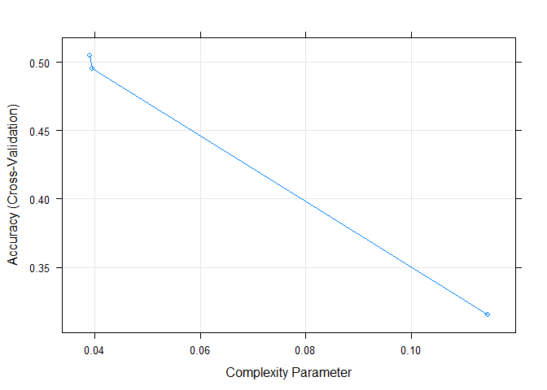
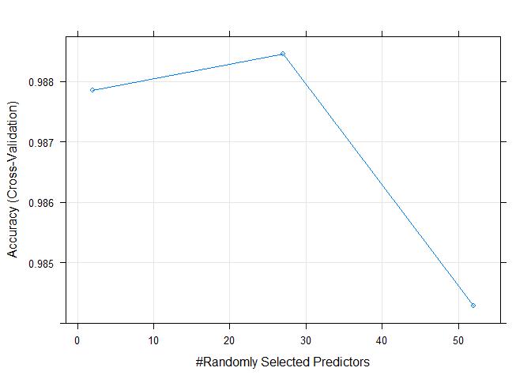

##Exercise Effectiveness Predictive Model ##
  
  Don Martin                      
  March 5, 2017
  
###Executive Summary###

Fitness tracking devices such as Jawbone Up, Nike Fuel Band, and Fitbit, enable people to inexpensively collect personal activity data, then find and change patterns in personal behavior to improve health. These devices can make it easy to quantify **how much** of a particular activity is completed, but rarely do they quantify **how well** activities are performed.  In our study six participants were asked to perform barbell lifts correctly and incorrectly five different ways. Observations were collected from accelerometers on each participant's belt, forearm, arm, and dumbbell. *Participants were asked to perform one set of 10 repetitions of the Unilateral Dumbbell Biceps Curl in five different fashions: exactly according to the specification (Class A), throwing the elbows to the front (Class B), lifting the dumbbell only halfway (Class C), lowering the dumbbell only halfway (Class D) and throwing the hips to the front (Class E).* This project leverages this accelerometer data to predict the manner in which the barbell lift exercises are performed.

###Data Processing###
**Data Acquisition**

Accelerometer data of 6 participants for this project will be obtained from: http://groupware.les.inf.puc-rio.br/har. The objective is to create a model to predict the manner in which participants performed barbell lift exercises as captured in the training set pml-training.csv **"classe"** variable. The code below is a repeatable process for obtaining and loading the study data.


```r
#   Establish & Create Data Directory
    if (!file.exists("./data")) { dir.create("./data") }

#   Retrieve and Load Training DataSet
    trainURL  <- "https://d396qusza40orc.cloudfront.net/predmachlearn/pml-training.csv"
    trainCSV  <- "./data/pml-training.csv"
    if (!file.exists(trainCSV)) {download.file( trainURL, destfile=trainCSV)}
    trainDf   <- read.csv(trainCSV, na.strings=c("NA",""), header=TRUE)

#   Retrieve and Load Testing DataSet
    testURL   <- "https://d396qusza40orc.cloudfront.net/predmachlearn/pml-testing.csv"
    testCSV   <- "./data/pml-testing.csv"
    if (!file.exists(testCSV)) {download.file( testURL, destfile=testCSV)}
    testDf    <- read.csv(testCSV, na.strings=c("NA",""), header=TRUE)
```

On initial inspection the training data set loaded into data frame **trainDF** contains 160 variables and 19622 observations. The testing data set, loaded into data frame **testDf** contains 160 variables and 20 observations. One notable difference is **trainDF** contains the **"classe"** variable, the target outcome describing the manner in which exercises were performed. The test data set **testDf** contains problem_id (int) instead of classe. 

This study will use the **trainDF** to train and validate different model(s). Cross-validation within the training partition of **trainDF** will be leveraged to improve model fit. The best model will be selected based on accuracy and performance. Finally, an out-of-sample test using the test data provided **testDf**  will be used to evaluate forecasting accuracy and performance of the selected model.

**Data Cleansing**

This section illustrates steps taken to prepare both train and test data. The data is cleansed, removing the variables(columns) that contain NA or missing values, or do not contribute to accelerometer measurements. As the **testDf** does not contain the "classe" variable, it will be set aside as the out-of-sample  **testDS** in this step.


```r
  InputDf  <- trainDf  # cleanse the Training Dataframe
#   Step 1. Remove Variables containing missing or NA values.
    InputDf <- trainDf
    Step01  <- InputDf[, colSums(is.na(InputDf)) == 0]
     
#   Step 2. Remove timestamp and window variables that do not describe accelerometer measurements
    target  <- grepl("^X|timestamp|window", names(Step01))
    Step02  <- Step01[, !target]
     
#   Step 3. Coerce accelerometer measurements (variables) to be numeric
    classe        <- Step02$classe   #Preserve the classe (factor) variable 
    Step03        <- Step02[, sapply(Step02, is.numeric)]
    Step03$classe <- classe   #Join classe to the remaining dataset
    inTrainDS     <- Step03
    
  InputDf  <- testDf # cleanse the Testing Dataframe (using the same steps)
#   Step 1. Remove Variables containing missing or NA values.
    Step01  <- InputDf[, colSums(is.na(InputDf)) == 0]
     
#   Step 2. Remove timestamp and window variables that do not describe accelerometer measurements
    target  <- grepl("^X|timestamp|window", names(Step01))
    Step02  <- Step01[, !target]
     
#   Step 3. Coerce accelerometer measurements (variables) to be numeric - classe doesn't exist in test
    Step03  <- Step02[, sapply(Step02, is.numeric)]
    testDS  <- Step03
```

Data cleansing has removed 107 null or un-interesting variables from each data set.  The training data set **inTrainDS** contains 53 variables and 19622 observations. The cleansed testing data set **testDS** contains 53 variables and 20 observations.  

**Data Slicing**

This section illustrates steps taken to split the training data set **inTrainDS** into a model training data set **trainDS** (60%) and a model validation data set **validationDS** (40%).


```r
# Load required packages
  library(caret)
 
  
  library(rattle)
  library(rpart.plot)
  library(RColorBrewer)
 

  set.seed(12345)  
  trainPar <- createDataPartition(inTrainDS$classe, p=0.60, list=F)
  trainingDS  <- inTrainDS[trainPar, ]   # 60%
  validationDS   <- inTrainDS[-trainPar, ]  # 40%
```

Data slicing split the data set **inTrainDS** into **trainingDS** containing 53 variables, 11776 observations, and **validationDS** containing 53 variables, 7846 observations.  

###Model Creation & Selection###

**Training Models using 5-fold cross-validation **

Two differnt model algorithms are trained below, Decision trees with CART (rpart), for its ease and peformance advantages, and Random forest decision trees (rf) for its accuracy.  Both models are fit on **trainingDS**.  A 5-fold cross-validation is used to select optimal tuning parameters for each algorithm.


```r
# Use 5-fold cross-validation to select optimal tuning parameters
  ctlRf <- trainControl(method="cv", 
                        number=5, 
                        verboseIter=F)
```

Decision trees with CART (rpart), is trained and graphed below.


```r
# Train Decision trees with CART (rpart)
  fitRp <- train(classe ~ ., 
                 data=trainingDS, 
                 method="rpart", 
                 trControl=ctlRf) 
# fitRp
  plot(fitRp, Main="Decision trees with CART")
```

<!-- -->

The accuracy of the optimal *decision trees with CART* algorithm is **0.4950918** or **49%**. Next Random forest decision trees is trained using the same **trainingDS** and graphed below.


```r
# Train Random forest decision trees (rf)
  fitRf <- train(classe ~ ., 
                 data=trainingDS, 
                 method="rf", 
                 trControl=ctlRf, 
                 ntree=250)
# fitRf
  plot(fitRf, Main="Random forest")
```

<!-- -->

The accuracy of the optimal *random forest decision trees* algorithm **0.988450** of **99%**.  Based on the difference in accuracy, the performance trade-off of the random forest is acceptable, and the **fitRf** model is selected.  

**Model Assessment **

In this section we assess the Random forest model's accuracy in predicting the manner participants performed barbell lift exercises as captured by the classe variable in **validationDS**.


```r
# Validate Random forest decision trees (rf)
  predictRf <- predict(fitRf, validationDS)
  cmatrixRf <-confusionMatrix(validationDS$classe, predictRf)
  os_error  <- 1 - as.numeric(confusionMatrix(validationDS$classe, predictRf)$overall[1])
  
  cmatrixRf
```

```
## Confusion Matrix and Statistics
## 
##           Reference
## Prediction    A    B    C    D    E
##          A 2229    3    0    0    0
##          B   10 1502    6    0    0
##          C    0    5 1359    4    0
##          D    0    0   22 1262    2
##          E    0    2    3    5 1432
## 
## Overall Statistics
##                                           
##                Accuracy : 0.9921          
##                  95% CI : (0.9899, 0.9939)
##     No Information Rate : 0.2854          
##     P-Value [Acc > NIR] : < 2.2e-16       
##                                           
##                   Kappa : 0.99            
##  Mcnemar's Test P-Value : NA              
## 
## Statistics by Class:
## 
##                      Class: A Class: B Class: C Class: D Class: E
## Sensitivity            0.9955   0.9934   0.9777   0.9929   0.9986
## Specificity            0.9995   0.9975   0.9986   0.9963   0.9984
## Pos Pred Value         0.9987   0.9895   0.9934   0.9813   0.9931
## Neg Pred Value         0.9982   0.9984   0.9952   0.9986   0.9997
## Prevalence             0.2854   0.1927   0.1772   0.1620   0.1828
## Detection Rate         0.2841   0.1914   0.1732   0.1608   0.1825
## Detection Prevalence   0.2845   0.1935   0.1744   0.1639   0.1838
## Balanced Accuracy      0.9975   0.9954   0.9882   0.9946   0.9985
```

```r
  os_error
```

```
## [1] 0.007902116
```

The estimated accuracy of the model is **0.9920979** or **99%** and the estimated out-of-sample error is **0.007902116** or **.79%**.  Below is a list of the important predictors for the model.


```r
# Validate Random forest decision trees (rf)
  varImp(fitRf)
```

```
## rf variable importance
## 
##   only 20 most important variables shown (out of 52)
## 
##                      Overall
## roll_belt             100.00
## pitch_forearm          58.89
## yaw_belt               56.94
## pitch_belt             46.46
## magnet_dumbbell_z      44.42
## magnet_dumbbell_y      40.99
## roll_forearm           40.18
## accel_dumbbell_y       21.24
## magnet_dumbbell_x      20.16
## roll_dumbbell          19.32
## accel_forearm_x        18.43
## accel_belt_z           16.27
## magnet_belt_z          15.70
## accel_dumbbell_z       15.37
## magnet_belt_y          12.99
## magnet_forearm_z       12.54
## total_accel_dumbbell   11.55
## gyros_belt_z           11.20
## yaw_arm                10.72
## magnet_belt_x          10.52
```

###Predicting for Test Data Set###

Finally we apply the the Random forest model **fitRf** to predict the manner participants performed barbell lift exercises for each of the 20 observations based on the accelerometer variables contained in the test data sample ('pml-testing.csv').
 

```r
# Predict using Random forest decision trees (rf)

  predictRf <- predict(fitRf, newdata=testDS)
  PredictionResults <- data.frame(problem_id=testDS$problem_id,
                                  predicted=predictRf)
  print(PredictionResults)
```

```
##    problem_id predicted
## 1           1         B
## 2           2         A
## 3           3         B
## 4           4         A
## 5           5         A
## 6           6         E
## 7           7         D
## 8           8         B
## 9           9         A
## 10         10         A
## 11         11         B
## 12         12         C
## 13         13         B
## 14         14         A
## 15         15         E
## 16         16         E
## 17         17         A
## 18         18         B
## 19         19         B
## 20         20         B
```
 
###Conclusion###

Given the data provided, the random forest model with cross-validation produces a surprisingly accurate model that sufficient to predict the manner participants performed barbell lift exercises in the study.

